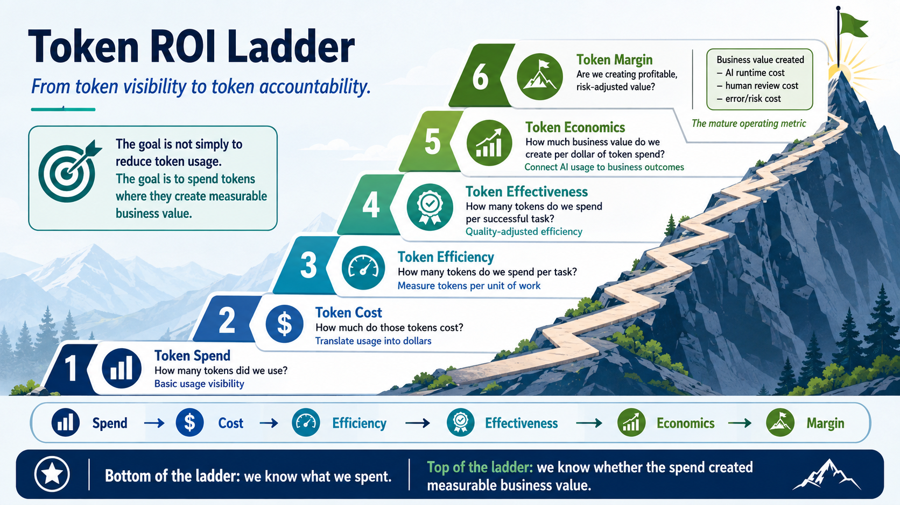
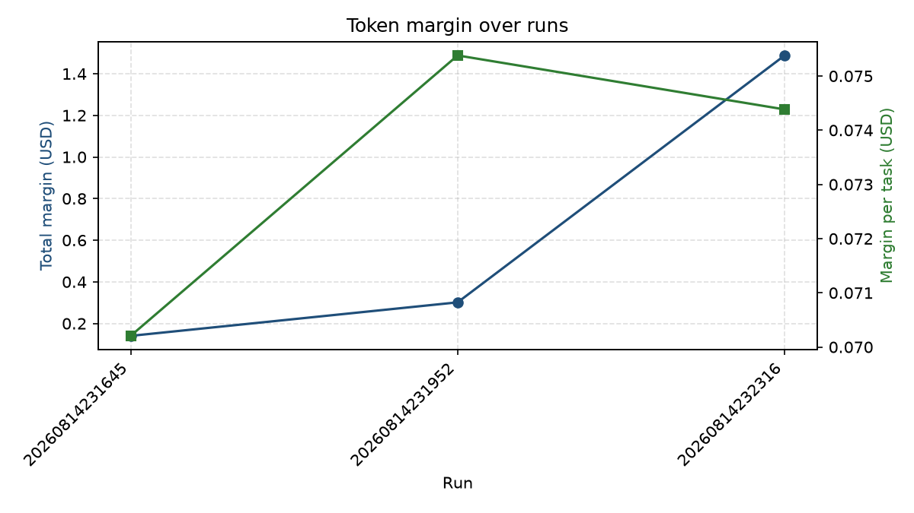

# Token-to-Value Ladder

This document captures the tokenomics thread of the project: a bottom-up framework for turning raw token usage into demonstrable business value, and how each rung is implemented in this repository.

The agent itself is small. The interesting engineering is the harness around it that can answer a question most agent demos cannot: not "does it work?" but "is the spend worth it?"

## The hill-climbing framework



Token economics works best as a ladder climbed one rung at a time. Each rung reframes the conversation, moving it away from raw AI usage and toward AI value.

```text
Step 6: Token Margin
        Are we creating profitable, risk-adjusted value?
        Business value - AI runtime cost - human review cost - error/risk cost

Step 5: Token Economics
        How much business value do we create per dollar of token spend?

Step 4: Token Effectiveness
        How many tokens do we spend per successful task?

Step 3: Token Efficiency
        How many tokens do we spend per task?

Step 2: Token Cost
        How much did those tokens cost?

Step 1: Token Spend
        How many tokens did we use?
```

At the bottom of the ladder, you know what you spent. At the top, you know whether the spend produced measurable value. The goal is not to minimize tokens. The goal is to climb from token visibility to token accountability.

Each rung depends on the one below it. You cannot price tokens you never counted, and you cannot compute value per dollar until you can price a successful task.

## How the ladder maps onto this project

The Prompt Agent runs in Microsoft Foundry. Everything on the ladder is owned by this repository: the client in [../src/foundry_prompt_agent/agent.py](../src/foundry_prompt_agent/agent.py) captures token usage, the pure tokenomics functions live in [../src/foundry_prompt_agent/tokenomics.py](../src/foundry_prompt_agent/tokenomics.py), and the orchestrator in [../evaluation.py](../evaluation.py) prints the ladder after each run.

| Step | Question | Where it lives | Data introduced |
| --- | --- | --- | --- |
| 1. Token Spend | How many tokens? | `ask_agent()` return value | `response.usage` per case |
| 2. Token Cost | What did they cost? | `PRICING` + `compute_cost()` | dollars per 1M tokens |
| 3. Token Efficiency | Tokens per task? | `summarize_efficiency()` | total tokens divided by task count |
| 4. Token Effectiveness | Tokens per successful task? | `summarize_effectiveness()` | success rate from the quality gate |
| 5. Token Economics | Value per dollar? | `summarize_economics()` | business value per success |
| 6. Token Margin | Profitable, risk-adjusted value? | `summarize_margin()` | review cost and error/risk cost |

> [!IMPORTANT]
> Foundry's monitoring dashboard already shows Steps 1 and 2 for production traffic (see [monitoring.md](monitoring.md), "Token usage" and "Latency"). What it does not do is tie tokens to task success or business value. That link exists only because this repository owns the evaluation harness. Steps 3 through 6 are where the Python harness earns its keep.

The rest of this document examines all six implemented rungs in depth.

## Step 1: Token Spend

The question: how many tokens did we use?

Spend is raw visibility. Before optimizing anything, every task must carry its own token count. The OpenAI Responses API returns this on `response.usage`, so the fix is to stop throwing that object away.

The agent client captures five fields per call:

```python
usage = {
    "model": response.model,
    "input_tokens": response.usage.input_tokens,
    "output_tokens": response.usage.output_tokens,
    "total_tokens": response.usage.total_tokens,
    "cached_tokens": response.usage.input_tokens_details.cached_tokens,
    "reasoning_tokens": response.usage.output_tokens_details.reasoning_tokens,
}
```

Two nested fields are captured for later rungs, not for display:

* `cached_tokens` is a subset of `input_tokens` that was served from cache. It is usually billed at a discount, so ignoring it overstates cost in Step 2.
* `reasoning_tokens` is a subset of `output_tokens` produced by a reasoning model while thinking. It is captured for visibility so you can see how much you pay to think versus to answer.

Capturing `response.model` matters because the agent's model is configured in Foundry, not in this repo. Letting the API report the model means cost attribution keys off reality rather than a hardcoded assumption.

The lesson: the results ledger becomes the foundation for every rung above it. If a task does not record what it spent, no later rung can reason about it.

## Step 2: Token Cost

The question: what did those tokens cost?

Tokens are a count. Cost is a dollar figure. The conversion is not a single rate, and three details make it worth understanding.

First, input and output are priced differently. Output almost always costs more than input, so `total_tokens` alone cannot produce a cost. This is why Step 1 captured the split.

Second, cached input is discounted. The `cached_tokens` subset is billed at a lower rate than fresh input, so the calculation prices it separately.

Third, reasoning tokens are already inside `output_tokens`. They must not be added again. Double-counting reasoning tokens is the classic first-attempt cost bug, and the code avoids it by never referencing `reasoning_tokens` in the math.

```python
def compute_cost(usage: dict) -> float:
    rates = PRICING[usage["model"]]  # KeyError here is a feature: unknown model = unpriced spend
    billed_input = usage["input_tokens"] - usage["cached_tokens"]
    return (
        billed_input / 1_000_000 * rates["input"]
        + usage["cached_tokens"] / 1_000_000 * rates["cached"]
        + usage["output_tokens"] / 1_000_000 * rates["output"]
    )
```

Prices live in a hardcoded `PRICING` dict keyed by model name, with a dated comment. An earlier version read prices from environment variables, but prices are neither secret nor environment-specific: they are public, stable facts about a model. Environment variables created needless coupling to CI configuration. A dict keyed by model is also more capable, because it prices whatever `response.model` reports instead of assuming a single model.

There are two cost centers in this project:

* Agent cost is the spend from `ask_agent()`, the product doing its work. It is computed precisely from captured usage.
* Judge cost is the spend the evaluators consume while scoring quality. The Foundry evaluation run does not reliably expose judge-token usage through the API, so judge cost is deferred to the economics rung where it actually affects value per dollar.

The lesson: keep pricing pure and dependency-free. The tokenomics module knows nothing about Azure or Foundry, which makes it easy to reason about and easy to grow.

## Step 3: Token Efficiency

The question: how many tokens do we spend per task?

A run total cannot be compared across runs. Change the dataset size and the total moves for a boring reason. Efficiency normalizes by work, producing tokens per task and cost per task. Now a comparison between two prompt versions is fair even when the datasets differ in size.

```python
def summarize_efficiency(usages: list[dict]) -> dict:
    tasks = len(usages)
    if tasks == 0:
        return {...}

    total_tokens = sum(u["total_tokens"] for u in usages)
    total_cost = sum(compute_cost(u) for u in usages)
    return {
        "tasks": tasks,
        "tokens_per_task": total_tokens / tasks,
        "input_tokens_per_task": total_input / tasks,
        "output_tokens_per_task": total_output / tasks,
        "cost_per_task": total_cost / tasks,
    }
```

Two design choices make this rung useful.

Efficiency is outcome-blind. It counts every task, whether it passed or failed. A cheaper-per-task agent looks better here even if it is wrong more often. That blind spot is exactly what Step 4 exists to fix, so the two rungs are kept separate on purpose.

The input and output rates are reported separately. When cost per task creeps up, the split reveals the cause: a bloated prompt raises input per task, while verbose or reasoning-heavy answers raise output per task. One number hides the cause. Two numbers point at it.

The lesson: record `tokens_per_task` and `cost_per_task` as a baseline. After any change to prompt or model, these rates show whether the agent got leaner or heavier per task, independent of how many cases ran.

## Step 4: Token Effectiveness

The question: how many tokens do we spend per successful task?

Effectiveness is total spend divided by successful outcomes. The word total matters: you paid for the failed tasks too, on the way to producing the good ones. The honest question is not what the passing cases cost in isolation. It is what it cost in total to get each success.

This produces a clean identity:

```text
tokens per success = total tokens / (success rate * tasks)
                   = tokens per task / success rate
```

Effectiveness is efficiency divided by success rate. The consequences are worth internalizing:

* At a 100 percent success rate, effectiveness equals efficiency. Nothing is wasted.
* At a 50 percent success rate, effective cost per success is double the per-task cost. Half the spend bought failures.
* As success approaches zero, cost per success approaches infinity. You are paying and getting nothing.

```python
def summarize_effectiveness(efficiency: dict, success_rate: float) -> dict:
    if success_rate <= 0:
        return {"tokens_per_success": float("inf"), ...}

    return {
        "success_rate": success_rate,
        "successful_tasks": success_rate * efficiency["tasks"],
        "tokens_per_success": efficiency["tokens_per_task"] / success_rate,
        "cost_per_success": efficiency["cost_per_task"] / success_rate,
    }
```

A key realization: this rung needs no per-case join between tokens and results. A per-case join answers a different, less useful question, namely what the passing rows alone consumed. For return on investment, the right metric is total spend over successful outcomes, and that needs only two numbers the harness already produces: the efficiency summary from Step 3 and the success rate from the quality gate. The rung stays aggregate and local.

Success needs a definition. This project has two evaluators, and the harness uses the behavior rubric as the success signal because it is the substantive judgment of whether the agent did the job well. Scope adherence is treated as a separate guardrail that the quality gate already enforces. Defining success as "passed both evaluators" would require the per-case combined pass count, which the aggregate results do not expose, so the behavior rubric keeps the rung minimal.

The lesson: compare `cost_per_success` against `cost_per_task`. The gap between them is the price of failure, the tax paid for tasks that did not work. Raising the success rate shrinks the gap, and at 100 percent the two converge.

## Step 5: Token Economics

The question: how much business value do we create per dollar of token spend?

Every rung so far answered a cost question. Economics asks the first value question, and answering it requires one input the system cannot produce on its own: the value of a single successful task. A correctly answered coffee question might be worth some amount of deflected support cost, but only the business can assert that figure. The harness takes it as an assumption.

Because the value of a success is a business assumption rather than a public fact, it belongs in configuration. Model prices are stable facts about a model and stay hardcoded, but value per success changes with deployment and context, so it is read from an environment variable with a sensible default:

```python
VALUE_PER_SUCCESS_USD = float(os.getenv("VALUE_PER_SUCCESS_USD", "0.10"))
```

With that input, economics is a short hop from Step 4 through another identity:

```text
value per dollar = (value per success * successes) / total cost
                 = value per success / cost per success
```

Value per dollar is the assumed value of a success divided by the effectiveness cost already computed in Step 4.

```python
def summarize_economics(efficiency, effectiveness, value_per_success):
    total_value = value_per_success * effectiveness["successful_tasks"]
    total_cost = efficiency["total_cost"]
    value_per_dollar = total_value / total_cost if total_cost > 0 else float("inf")
    return {
        "value_per_success": value_per_success,
        "total_value": total_value,
        "total_cost": total_cost,
        "value_per_dollar": value_per_dollar,
    }
```

When a success is worth cents and costs a tiny fraction of a cent in tokens, the ratio lands in the hundreds or thousands. That number is what reframes a conversation from "AI is expensive" to "each dollar of token spend returns this much value."

Two honesty notes about this rung:

* The cost side is agent token spend only. Judge and evaluation tokens are still deferred, so the real ratio is somewhat lower than printed. Including that spend is part of the margin rung.
* The ratio is only as trustworthy as the `value_per_success` assumption. Treat it as a lever to reason about, not a precise accounting figure.

The lesson: a single assumed number turns the cost ladder into a value ladder. The quality of that assumption, not the arithmetic, is what makes the ratio credible.

## Step 6: Token Margin

The question: are we creating profitable, risk-adjusted value?

Economics compared value against token spend, but tokens are rarely the real cost of running an agent. Margin is the complete accounting:

```text
margin = business value created
       - AI runtime cost      (tokens: agent plus any judge spend)
       - human review cost    (a person checking outputs)
       - error/risk cost      (what failures actually cost)
```

```python
def summarize_margin(efficiency, effectiveness, economics,
                     review_cost_per_task, error_cost_per_failure,
                     judge_cost_per_run=0.0):
    tasks = efficiency["tasks"]
    failed_tasks = tasks - effectiveness["successful_tasks"]

    value = economics["total_value"]
    ai_runtime_cost = economics["total_cost"] + judge_cost_per_run
    human_review_cost = review_cost_per_task * tasks
    error_risk_cost = error_cost_per_failure * failed_tasks

    margin = value - ai_runtime_cost - human_review_cost - error_risk_cost
    return {..., "margin": margin, "profitable": margin > 0}
```

The three subtracted costs are business assumptions, so they follow the same pattern as value per success: environment variables with defaults.

Two lessons surface here that the lower rungs cannot show.

Human review cost often dominates. If a person skims every answer, that labor can dwarf the token cost and even push margin negative. This is the uncomfortable truth behind many claims that AI is cheap: the model tokens were cheap, but the human in the loop was not. Review cost also ties back to trust, because the more the success rate justifies automation, the less review the outputs need.

Failures are punished twice. Error and risk cost scales with failed tasks, which is `tasks - successful_tasks`, so a low success rate hurts effectiveness in Step 4 and then hurts margin again here. Quality is not a soft metric on this ladder. It moves the money.

The deferred judge and evaluation spend finally gets a home through `judge_cost_per_run`, which is added to AI runtime cost. It defaults to zero because Foundry does not reliably expose judge-token usage, so the model provides an honest slot to fill with an estimate rather than a fabricated number.

The lesson: margin is where quality, cost, and business value meet. A technically impressive agent with a poor success rate or heavy review burden can still lose money, and this rung is the only one that makes that visible.

## Run history

A single run prints the ladder once. The value grows when you can watch it move. After each completed run, `evaluation.py` appends one compact record to [../evals/tokenomics_history.jsonl](../evals/tokenomics_history.jsonl) through the pure `ladder_record()` helper, tagged with the run id and a UTC timestamp.

Each line captures the headline numbers from every rung: tasks, total tokens and cost, cost per task, success rate, cost per success, value per dollar, and margin. Because the file is append-only JSONL, a change to the prompt or model can be judged on the trend rather than a single snapshot. A prompt edit that raises quality but also raises cost per success is easy to miss in one run and obvious across ten.

### Observations from the first three runs

The first three records contain 2, 4, and 20 tasks respectively. All three report a 100 percent behavior success rate, so `cost_per_success` equals `cost_per_task` in every run. No token spend was lost to failed behavior cases, and the error/risk term contributed zero to margin under the current assumptions.

The normalized results vary materially with sample size:

* Tokens per task fell from 2,680 in the two-task run to 1,560 in the four-task run, then settled at 1,813.4 in the twenty-task run.
* Cost per task fell from $0.009794 to $0.004621, then rose to $0.005617. The twenty-task result is about 43 percent cheaper per task than the two-task result, but about 22 percent more expensive than the four-task result.
* Value per dollar moved inversely because success stayed at 100 percent and value per success remained $0.10: 10.2x, 21.6x, then 17.8x.
* Margin per task was comparatively stable at approximately $0.0702, $0.0754, and $0.0744. Total margin rose mainly because more successful tasks were processed, so total margin should not be used to compare runs of different sizes.

The four-task run is the most efficient of the three, but it is too small to establish that the agent became more efficient. Different case mixes can produce large swings in prompt length, retrieved context, reasoning, and response length. The twenty-task run is the strongest current baseline because it averages over more cases, although one successful run is still not enough to establish a stable trend.

The fact that the two-task run used fewer total tokens than the four-task run but cost slightly more shows that token composition matters. Input, cached input, and output have different prices. The current history stores only total tokens and total cost, so it cannot explain whether this difference came from output volume, cache usage, or another part of the token mix.

These comparisons are valid only when the model, pricing table, value-per-success assumption, review cost, error cost, and evaluation contract remain unchanged. Future history records should also capture those inputs, plus input, cached, output, and reasoning-token totals, to make changes attributable rather than merely observable.



The chart plots both series deliberately. Total margin in blue climbs from run to run, but that rise mostly tracks task count and says little about the agent itself. Margin per task in green is the fair comparison, and it stays in a narrow band near $0.07, which is the real signal: per-unit economics held steady across the three runs. The plot is generated by [../plot_history.py](../plot_history.py), which reads the history file, prints a per-run table, and writes the image. Regenerate it after new runs with `uv run --group viz plot_history.py`.


## What comes next

All six rungs are implemented: tokens, dollars, cost per task, cost per success, value per dollar, and risk-adjusted margin. The ladder is complete from token visibility at the bottom to token accountability at the top.

The natural extensions from here are about strengthening the inputs rather than adding rungs:

* Replace the assumed business costs with measured figures once real review time and failure impact are known.
* Estimate judge and evaluation spend to sharpen the AI runtime cost term.
* Chart the appended run history to visualize margin trends over time.

The through-line of the whole ladder matches the core lesson of the project: trust comes from repeatable evidence, and value comes from measuring spend against outcomes rather than counting tokens in isolation.
